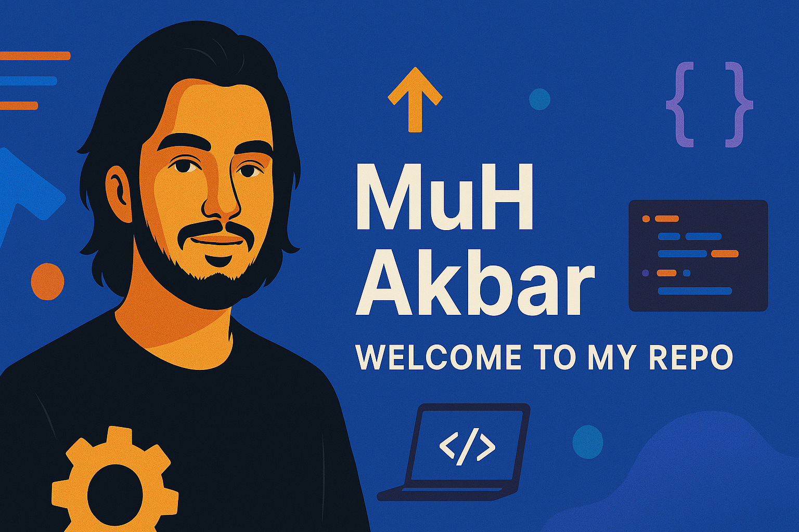

# 👋 Hi, I'm MuH Akbar  
💻 Student | Web & Mobile Developer | Tech Enthusiast  

Welcome to my GitHub profile!  
Here I share projects related to **web development, mobile apps, and academic works**, built as part of my learning journey and personal exploration in technology 🚀

---

  

---

## 🧠 Skills & Technologies

### 💻 Programming Languages

  

---

### 🎨 Design Tools

  
  
  

---

## 📬 Contact Me

  

---

## 📊 GitHub Statistics

  

---

✨ *“Learning by building, improving by failing.”*  
Thanks for visiting my profile!
